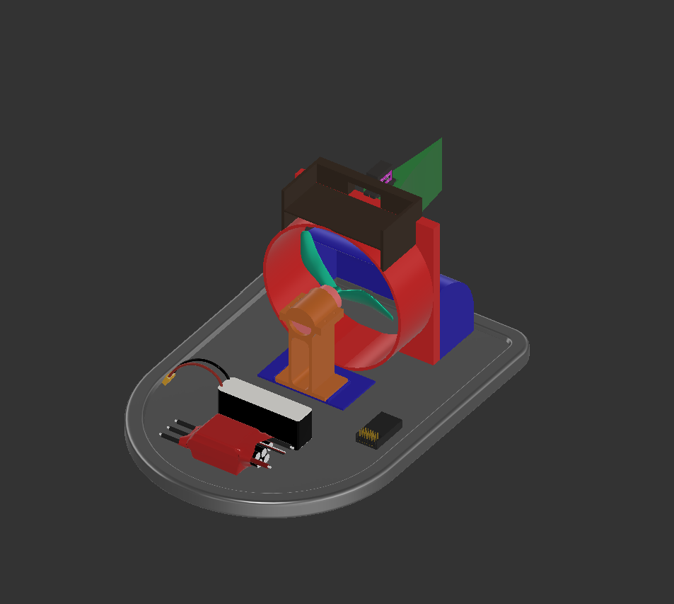
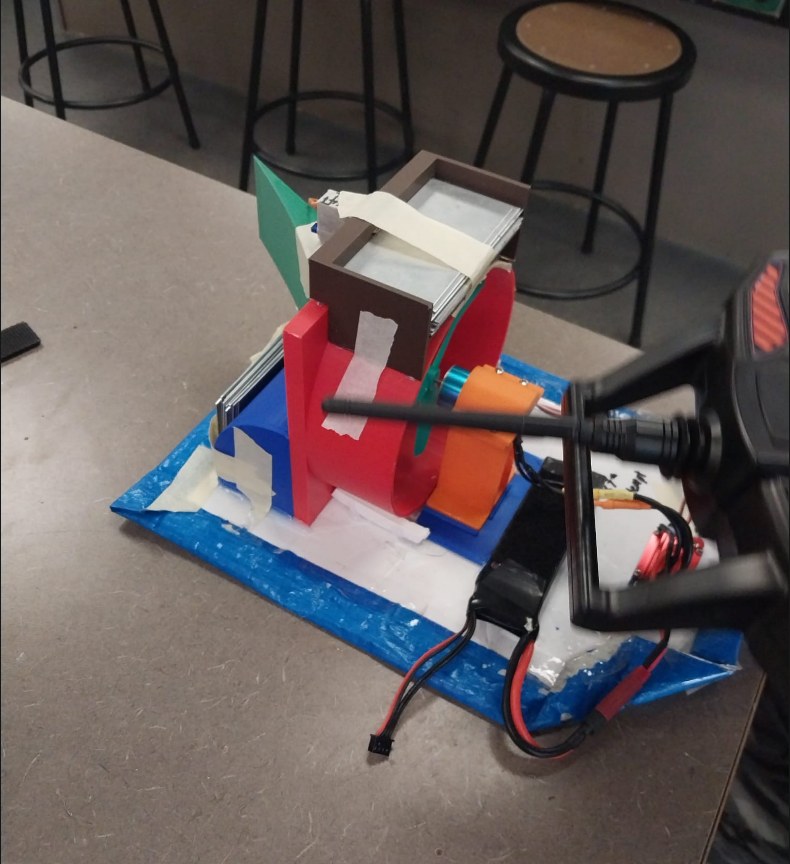
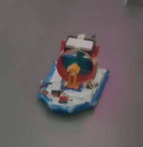
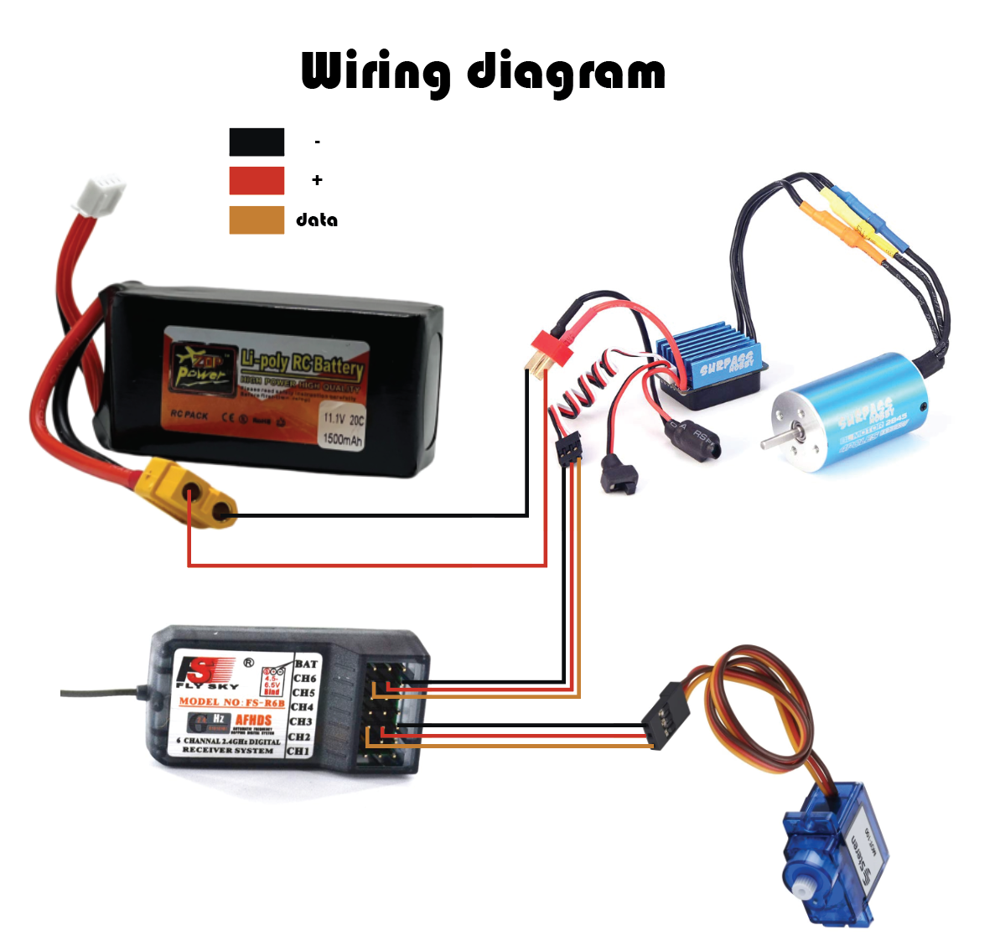
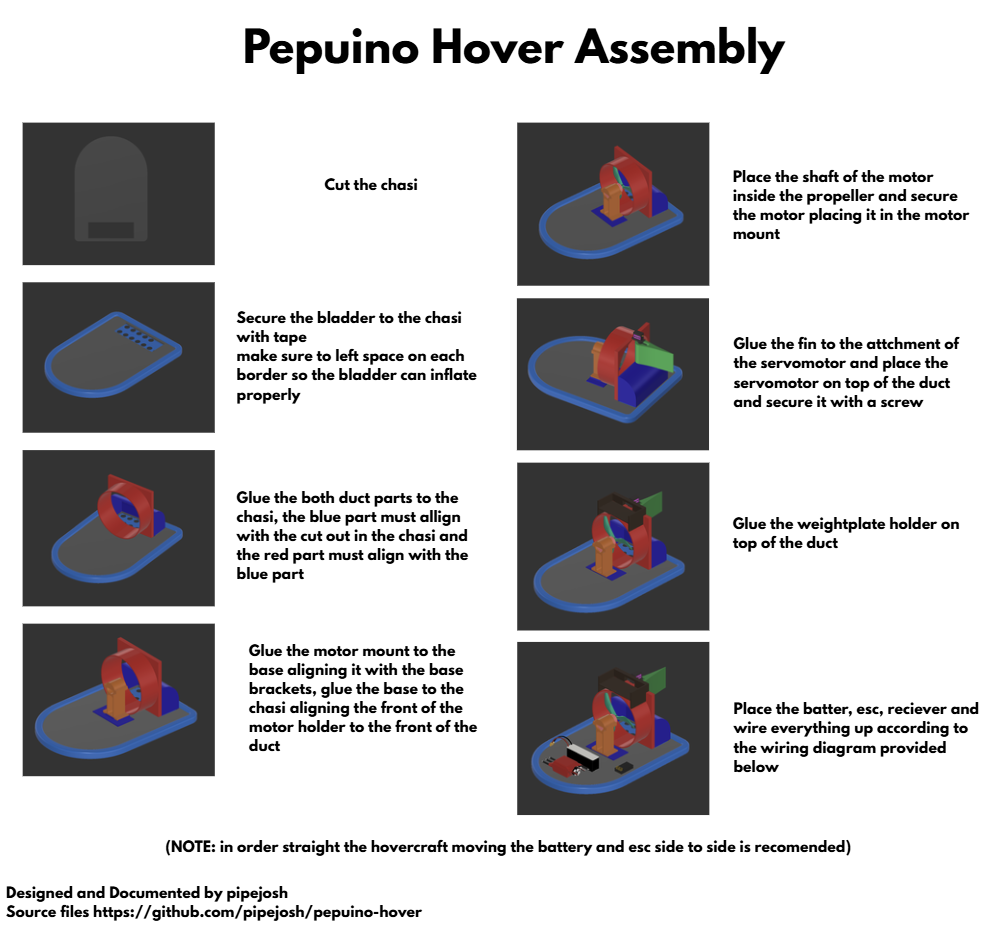

# Hovercraft!

This is a fully diy hovercraft, most of their parts are fully 3d printed, the only parts that are not is the foam chasi and the camping tarp bladder powered by a brushless motor, capable of hovering, and stearing. 

## Background 

Recently my friends wanted to start doing some RC stuff, we origninally wanted to do a drone, but the teacher gave us another challenge. Do a hovercraft, the idea was simple, he give us all the suplies, motor, esc, controller batteris and unlimited use of the school machines. The catch was, I had 1 month to do it, and if I was succesfull he would let us keep it. If we were not we had to sort all of the mixed up resistors he had in a box, so we accepted the challenge 

Turns out he would regreat this deal because the hovercraft would work flawlessly

(Note none of the parts on the render are the actual ones used, since I couldnt find the 3d models for them, they are there just just illustration effects + I didnt add the step of the prop since it is too big for github)

# Images

## Hovercraft Render!
 

## Hovercraft Images!
 

## Wiring diagram
 

# Assembly Instructions
 

# Video of the hovercraft

[Hovercraft video on Reddit](https://www.reddit.com/r/hovercraft/comments/1qpj7pu/our_very_colorfull_rc_hovercraft/)

# BOM

| KIT Items | Description | Quantity | Unit Price | Total Price | URL |
|-----------|-------------|----------|------------|-------------|-----|
| Motor + esc | surpass hobby shaft 2mm | 1 | 39,05 | 39,05 | https://www.aliexpress.com/item/1005010413102445.html?spm=a2g0o.productlist.main.35.5d322733e9bgpJ&algo_pvid=df574532-fb10-488d-b8f2-22c61ff3d3ad&pdp_ext_f=%7B%22order%22%3A%224%22%2C%22eval%22%3A%221%22%2C%22fromPage%22%3A%22search%22%7D&utparam-url=scene%3Asearch%7Cquery_from%3A%7Cx_object_id%3A1005010413102445%7C_p_origin_prod%3A |
| Controller + transmiter |  | 1 | 37,51 | 37,51 | https://www.aliexpress.com/item/1005010065941933.html?spm=a2g0o.productlist.main.4.4c94pKaipKaitq&aem_p4p_detail=202601281316196206854755834480001138766&algo_pvid=c702e618-24c5-45ad-9e5b-2df45795bb62&pdp_ext_f=%7B%22order%22%3A%22249%22%2C%22eval%22%3A%221%22%2C%22fromPage%22%3A%22search%22%7D&utparam-url=scene%3Asearch%7Cquery_from%3A%7Cx_object_id%3A1005010065941933%7C_p_origin_prod%3A&search_p4p_id=202601281316196206854755834480001138766_1 |
| foam | this is used in the chase | 1 | 1,50 | 1,5 | https://dollarama.instacart.com/store/dollarama/products/28550706-foam-board-white-each |
| camping tarp | this is used in the bladder | 1 | 3,73 | 3,73 | https://www.aliexpress.com/item/1005005823228526.html?spm=a2g0o.productlist.main.5.54c23ccdHPSVFd&algo_pvid=01d2fe1f-da44-4cb1-b598-6effcd5872be&pdp_ext_f=%7B%22order%22%3A%226%22%2C%22eval%22%3A%221%22%2C%22fromPage%22%3A%22search%22%7D&utparam-url=scene%3Asearch%7Cquery_from%3A%7Cx_object_id%3A1005005823228526%7C_p_origin_prod%3A |
| m3 scews | this is for the motor holder | 50 | 0,04 | 2,22 | https://www.aliexpress.com/item/1005005070119421.html?spm=a2g0o.productlist.main.4.346548abTSLbqS&aem_p4p_detail=202601281612331345703967835430001351504&algo_pvid=213e2f25-673b-4508-b379-41550e93f2c5&pdp_ext_f=%7B%22order%22%3A%229873%22%2C%22eval%22%3A%221%22%2C%22fromPage%22%3A%22search%22%7D&utparam-url=scene%3Asearch%7Cquery_from%3A%7Cx_object_id%3A1005005070119421%7C_p_origin_prod%3A&search_p4p_id=202601281612331345703967835430001351504_1 |
| aliexpress tax |  |  |  | 5,00 |  |
| **Total** |  |  |  | **89,01** |  |

